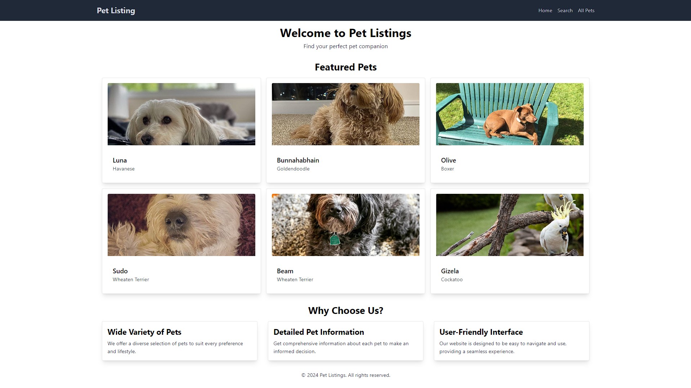
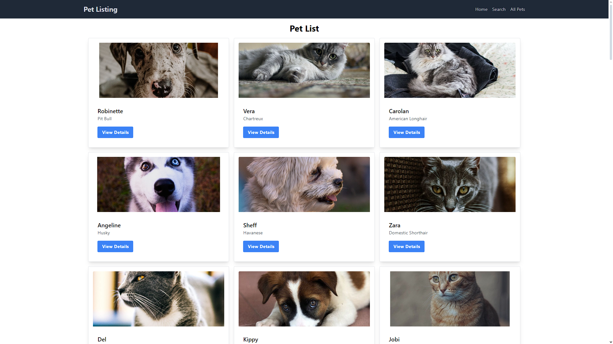
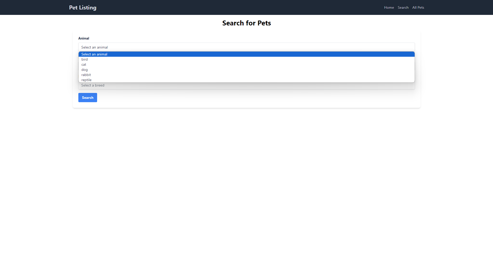
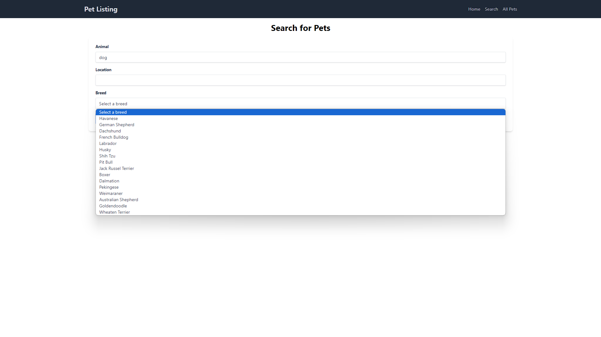
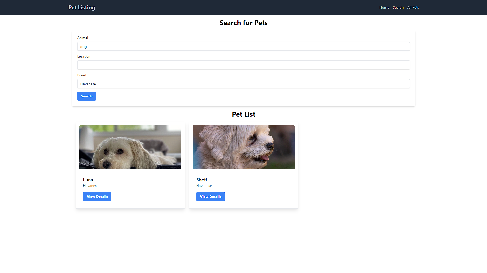
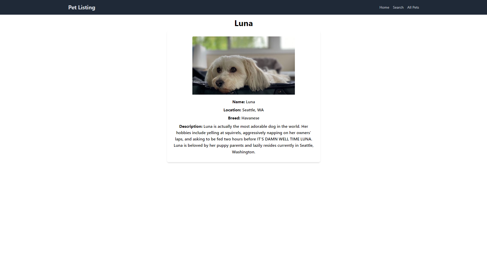

# Pet Listing Website

This is a Pet Listing website built using React.js and Vite. It allows users to search for pets based on animal type, location, and breed. The website fetches data from an external API and displays the results in a user-friendly manner.

## Table of Contents

- [Features](#features)
- [Project Setup](#project-setup)
- [Environment Variables](#environment-variables)
- [APIs Used](#apis-used)
- [Folder Structure](#folder-structure)
- [Usage](#usage)
- [Screenshots](#screenshots)

## Features

- Search for pets by animal type, location, and breed.
- Display pet details, including name, breed, and image.
- Responsive design using Tailwind CSS.
- Error handling and loading states.
- Clean and maintainable code following best practices.

## Project Setup

1. Clone the repository:

   ````bash
   git clone https://github.com/Syed-Sarkheel/pet-listing.git
   cd pet-listing

   ````

2. Install dependencies:

```bash
  npm install
```

3. Start the development server:

```bash
  npm run dev
```

## Environment Variables

Create a `.env` file in the root directory and add the following environment variable or just rename `.env.sample` to `.env`:

```plaintext
VITE_API_URL=http://pets-v2.dev-apis.com
```

## APIs Used

- **List of Pets:** Fetches a list of pets.

  - URL: `${VITE_API_URL}/pets`

- **Pets by ID:** Fetches a pet's details by its ID.

  - URL: `${VITE_API_URL}/pets?id=${id}`

- **Breed by Animal Type:** Fetches breeds for a specific animal type.

  - URL: `${VITE_API_URL}/breeds?animal=${animal}`

- **Search API:** Searches for pets based on animal type, location, and breed.
  - URL: `${VITE_API_URL}/pets?animal=${animal}&location=${location}&breed=${breed}`

## Usage

### Search for Pets:

1. Select an animal from the dropdown.
2. Optionally, enter a location and select a breed.
3. Click on the "Search" button to fetch and display the results.

### View Pet Details:

- Click on the "View Details" button on any pet card to see detailed information about the pet.

## Screenshots

### Home Page



### All Pets



### Search







### Pet Description


